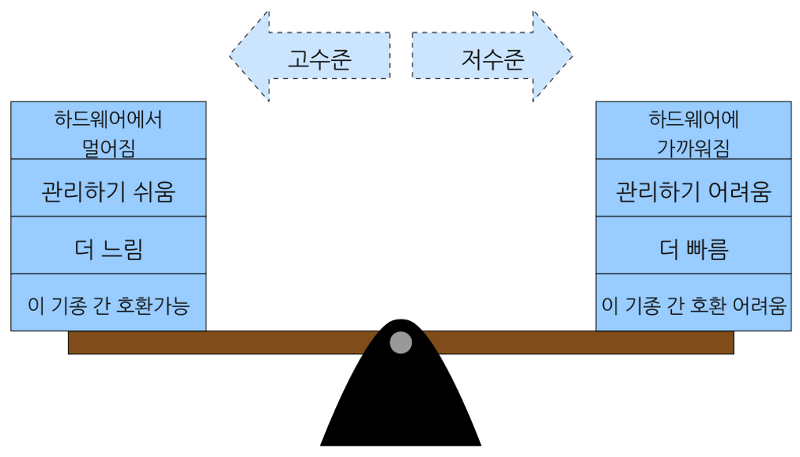
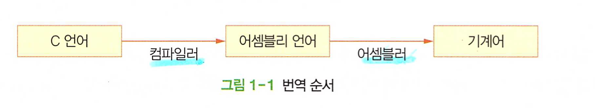
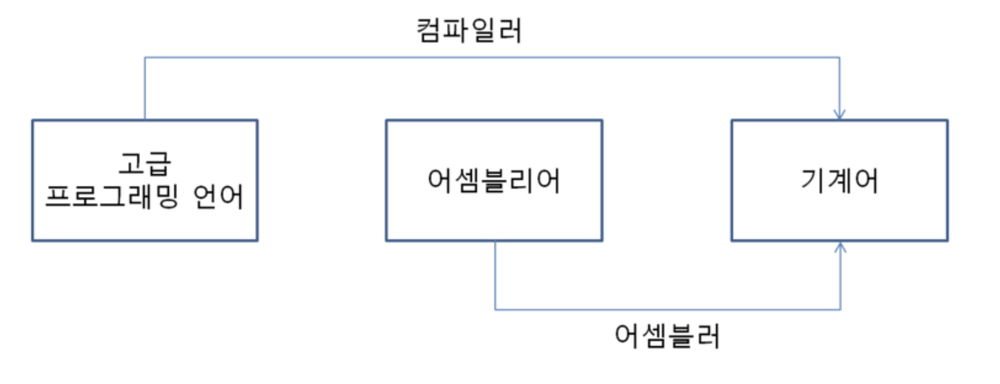
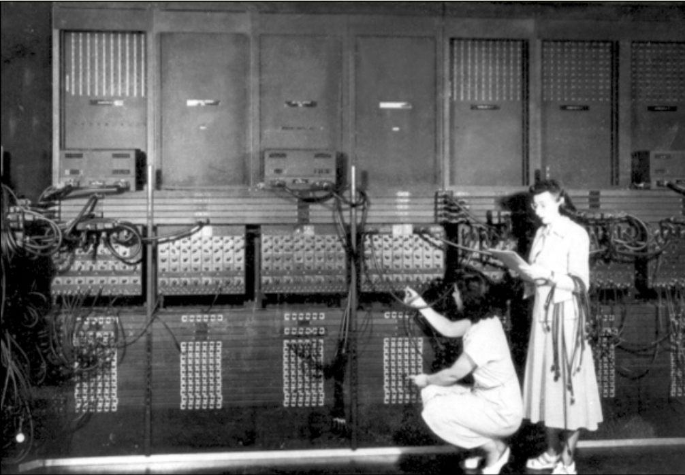

# 항해99 CS 스터디: 소프트웨어

## 26. 고수준 언어에서 프로그램 실행까지

### 1. 프로그램: 컴퓨터에 명령을 전달하는 수단

- 프로그램이란 무엇인가? 사람이 컴퓨터와 소통하고, 원하는 동작을 컴퓨터에게 전달하기 위한 명령문이 모인 것
- 컴퓨터는 0과 1 두 단어밖에 이해하지 못함, 컴퓨터에게 명령을 전달하기 위해서는
  - 첫 번째, 컴퓨터가 직접 이해할 수 있는 0과1로 구성된 언어(기계어, Machine Language)를 직접 사람이 전달하거나
  - 두 번째, 사람이 이해할 수 있는 형태의 언어로 프로그램을 작성하고, 번력 과정(컴파일링, 어셈블링)을 통해서 기계어로 번역하여 컴퓨터에 전달해야 함
- 첫 번째 방법은 프로그램을 작성하는 사람의 부담이 크기 때문에 우리는 두 번째 방법으로 프로그램을 작성하고 컴퓨터에 명령을 전달

### 2. 고수준/저수준 언어의 차이
- 고수준/저수준 언어의 구분 기준
  - 고수준 언어: 사람이 이해하기 쉬운 언어(C, JAVA 등 우리가 일반적으로 알고 있는 일반적인 프로그래밍 언어)
  - 저수준 언어: 컴퓨터가 이해하기 쉬운 언어(어셈블리어, 기계어). 어셈블리 언어도 결국 기계어를 조금 더 쉽게 이해하기 위한 언어이며, 컴퓨터에 명령어를 전달하기 위해서는 기계어로 번역되어야함
- 고수준 언어에서 저수준 언어로 넘어갈 수록 컴퓨터 하드웨어를 좀더 직접적으로 관리하고 프로그래밍 성능을 향상시킬 수 있으나, 사용자 입장에서 프로그램 작성 난이도가 상승함
  - 저수준 언어에서는 프로그램 문장 자체 오류 정도를 제외한 에러를 검출하기  어려우며, 컴퓨터 하드웨어 제조사에 따라 다른 내용을 작성해야 할 수 있음
- 고수준/저수준 언어의 차이

### 3. 프로그램 실행 과정

- 사람에 의해 작성된 프로그램(고수준 언어)는 컴파일링과 어셈블링 과정을 통해서 최종적으로 기계어로 번역되어 컴퓨터에 전달
  - 컴파일링: 작성된 프로그램을 컴파일러를 통해 어셈블리 언어로 변환하는 과정.
  - 어셈블링: 어셈블리 언어를 기계가 이해할 수 있는 기계어로 변환하는 과정. 

## 33. 컴퓨터를 작동하게 만드는 운영체제
### 1. 운영체제란 무엇인가?

- 운영체제는 컴퓨터의 하드웨어를 관리하고 다른 애플리케이션(운영체제 위에서 실행되는 프로그램)을 관리하는 기초 프로그램.
- 운영체제가 하나의 집이라면, 애플리케이션은 TV와 컴퓨터와 같이 집 안에서 하나 이상의 기능을 수행하는 하나의 부속이라고 비유할 수 있음.

### 2. 운영체제의 역사(운영체제=앱에서 운영체제!=앱으로)

- 1950년대: 운영체제=애플리케이션의 시기. 당시에는 하드웨어 성능 수준이 낮아 하나의 컴퓨터에 하나의 기능을 하는 프로그램만을 실행하는 것이 가능. 운영체제는 동작하는 애플리케이션을 제어하는 정도만의 기능을 담당
- 운영체제=집이라면, 집이 너무 좁아 세탁기 하나를 돌리는 것이 고작이라 집=세탁기나 마찬가지인 상황
- 1950년대 이후: 하드웨어의 성능이 향상되면서 운영체제!=애플리케이션의 시대로 돌입. 하드웨어를 제어하는 운영체제의 고유 역할이 강화됨.
- 최근: 컴퓨터 내 구성 요소들이 다양해지고 하드웨어 및 소프트웨어 측면 모두에서 관리하고 처리해야 할 내용들이 증가하면서 운영체제의 역할이 과거 대비 확기적으로 확대.

### 3. 운영체제의 역할

- 운영체제는 컴퓨터의 자원(리소스, 하드웨어 및 소프트웨어 등 컴퓨터가 동작하며 소모하는 유무형 자원을 모두 일컫는 말)을 제어하고 할당.
  - 운영체제 하에서 돌아가는 수많은 애플리케이션들의 교통정리를 담당하며, 이를 통해 제한된 리소스로 최대한의 성능을 이끌어내는 역할을 수행)
  - 각각의 어플리케이션을 자동차에 비유하면, 운영체제는 교통 경찰과 같은 역할을 수행.
- 운영체제는 주기억 장치(메모리)를 관리. 보조기억장치(하드웨어)에서 필요한 데이터 일부를 가져와 주기억장치에 옮기고, 수정된 데이터를 다시 보조기억장치에 저장하는 과정을 조율. 이를 통해서 메모리 용량이 프로그램이 동작하는데 충분하도록 설정
  - 메모리를 탄창, 보조기억장치를 탄약창고로 비유하면, 운영체제는 탄창에 필요한 총알을 유기적으로 관리하는 탄약병 같은 역할을 수행
- 운영체제는 보조기억장치(하드디스크)에 저장된 정보를 관리. 파일 시스템을 통해 보조기억장치에 저장된 데이터들을 우리에게 익숙한 계층 구조로 분류
- 운영체제는 컴퓨터에 연결된 외부 장치들을 관리. 각종 입출력장치(디스플레이, 키보드, 마우스 등)들을 관리하여 해당 장치들이 동작(클릭, 타이핑 등)하면서 전달되는 정보들을 컴퓨터 안의 프로그램에 전달.
