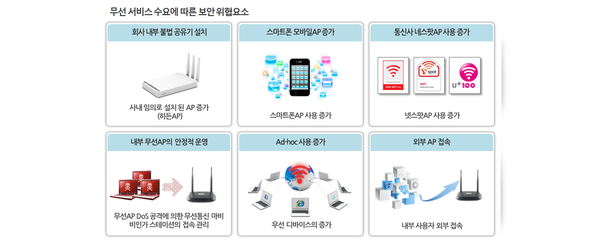

# 항해99 CS 스터디: 통신

## 79. 곳곳에 도사리는 위험

### 보안 위험은  크게  3가지 범주로 나누어짐: 클라이언트 / 서버 / 전송 중 정보에 대한 공격

- 이는 정보 교환 당사자(클라이언트, 서버), 정보 교환 과정(전송 중 정보)에 대한 공격으로 재분류가 가능함

### 클라이언트 공격

- 필요 이상의 정보를 제공(스팸), 클라이언트로부터 정보를 도용(피싱 및 스파이웨어 등)하는 등의 방법으로 크라이언트를 공격. 이를 통해서 클라이언트의 행동을 방해하거나 중요한 정보(개인정보 등)을 유출하는 피해가 발생.
- 스팸(spam): 클라이언트에게 원하지 않는 정보를 메일 등을 통해 다량으로 제공해서 일상적인 행동(업무 등)을 방해하는 공격.
  - 최근에는 머신러닝 등의 방법으로 스팸 메일을 필터링하는 방법 등으로 대응 중.
  - 그러나 공격자 측도 다양한 공격 패턴들 도입하여 대응, 스팸 공격 형태에 대한 꾸준한 모니터링 필요.
- 피싱(phishing): 공격자 측에서 필요한 정보를 클라이언트가 자발적으로 넘겨주도록 유도하는 공격. 공격 표적을 특정하여 공격하는 스피어 피싱(spear phishing) 등 다양한 공격 방식이 존재.
  - 지인 또는 셀러브리티, 국가 기관 등으로 발신자를 속여 클라이언트가 일정 URL이나 메일을 확인하도록 유도, 이를 통해 클라이언트 시스템에 프로그램을 설치하여 필요한 정보를 도용.
- 공격자가 클라이언트의 PC에 프로그램을 설치하여 공격하는 방식 또한 다양하게 존재.
  - 스파이웨어(spyware): 클라이언트 내 컴퓨터에서 필요한 정보를 다른 곳으로 보내는 프로그램.
  - 봇(bot): 특정 조건이 충족될 경우 공격자가 요구하는 명력을 수행하도록 세팅된 프로그램.
  - 랜섬웨어(ransomware): 클라이언트 PC에 저장된 콘텐츠를 강제로 암호화하는 공격. 공격자는 암호화된 데이터의 복호화를 조건으로 금품 등을 요구. 랜섬웨어의 단순한 형태로 악성 코드 감염 사실을 협박해 금품을 요구하는 스케어웨어(scareware)가 있음.
- 이러한 공격에 대응하기 위한 근본적인 대응책은 불필요한 정보를 다운받지 않거나 다운로드한 파일을 클라이언트 허가 없이 임의로 여는 설정을 제어하는 것. 브라우저나 백신을 최신 상태로 유지하는 것은 부분적인 방어수단일뿐.
  
### 서버 공격

- 서버의 경우 대량의 정보를 처리하고 복잡한 프로그램이 구동되어 버그와 오류가 자주 발생. 이를 악용한 공격이 주로 수행.
- 서버 시스템이 해킹될 경우 발생 가능한 피해는 무제한. 특히 서버 접근 및 설정 변경에 대한 권한이 공격자에 넘어갈 경우 서버 내 모든 데이터가 피해 대상이 될 수 있음. 최근까지는 기업이 보유한 개인 정보 유출 피해가 다수 발생 중.
- 서버 공격의 주요 형태
  - SQL 주입(SQL injection): 서버의 보안상 취약점을 이용해 임의의 sql 쿼리를 주입해 서버의 비정상적 동작을 유도하는 공격.
  - DOS(Denial of serviece), DDOS(Distributed Denial of serviece): 대량의 트래픽을 서버에 동시에 요청하여 서버의 동작을 마비시키는 공격, DOS 공격이 다수의 봇을 통해 다양한 출처에서 진행된다면 DDOS.

### 전송 중인 정보에 대한 공격

- 최근에는 무선 시스템을 통한 정보 교환이 확산(스마트폰, 와이파이 등)되면서 관심이 확대되고 있는 공격 방법. 최근 VPN과 화상 회의 사용이 빈번해지면서 전송 중인 정보에 대한 공격 대응 필요성이 확대 중.
- 무선 공격의 경우에는 사용자들이 보안에 대한 경각심이 높지 않다는 것이 문제.
- 코로나19 확산과 더불어 사용자 수가 급증한 줌(ZOOM)의 경우, 화상 회의 중에 제3자가 침입하여 음란물을 배포하거나 인종 차별적인 메세지를 전달하는 사건들이 발생.
- 
