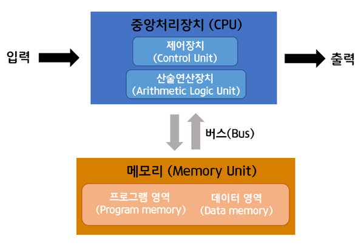
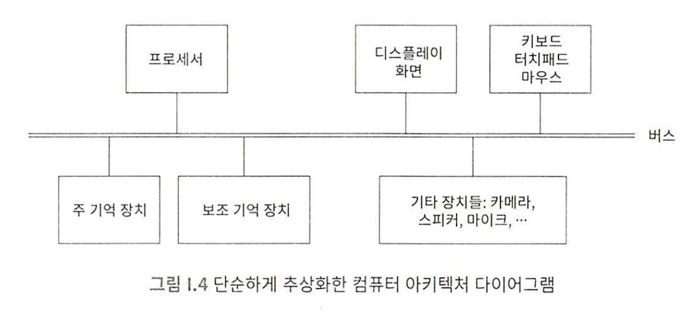

# 항해99 CS 스터디: 하드웨어

## 1. 컴퓨터의 논리와 구조

#### 컴퓨터는 크게 논리적, 물리적 측면에서 접근할 수 있음
1. 논리적 측면(무얼 하는가?): 컴퓨터는 어떠한 일을 하는가?, 그 일을 하기 위해 각 부분이 어떻게 구성되고 역할을 수행하는가?
2. 물리적 측면(어떻게 만들어지는가?): 컴퓨터 내 각 부분이 어떻게 물리적으로 만들어지고 구성되어 있는가
3. 예시: 노트북 컴퓨터
   - 논리적 측면: 각종 프로그램을 실행, 이를 위해 CPU, RAM, HDD 등이 각각의 역할을 수행하기 위해 구성됨
   - 물리적 측면: CPU는 인텔 10세대, RAM은 DDR5, 등등
4. Check-Point
   - **컴퓨터는 물리적 구성 측면에서는 많은 변화가 있었으나, 논리적 구성 측면에서는 변화한 것이 없다.**
   - 컴퓨터의 각 부분은 수 많은 변화가 있었으나, 각 부분이 어떠한 기능을 하는지에 대해서는 변화한 것이 없음

## 2. 프로세서 속도와 심장 박동 수

#### 컴퓨터의 구성
1. 컴퓨터의 논리적 구성의 기반: 1946년 폰 노이만 아키텍처
   - 폰 노이만은 중앙처리장치와 메모리, 프로그램, 입출력장치로 구성되는 컴퓨터 구조를 고안
   - 사용자가 데이터를 입력하면, 컴퓨터가 중앙처리장치와 메모리를 통해 결과값을 도출한 후 해당 결과값을 출력하는 방식
   - [사진] 폰노이만구조
    
   - 여기서의 핵심은 폰 노이만의 컴퓨터는 **프로그램 내장 기반 컴퓨터라는 것!**
   - 과거(비프로그램 내장형)에는 사용자가 컴퓨터의 계산을 위한 프로그램을 외부에서 물리적으로 코드를 꽂아서 설계
   - 프로그램을 컴퓨터에 내장할 경우, 작업 변경이 매우 수월(내부에서 프로그램만 교체하면 됨)
   - 1946년 설계된 논리적 구성이 현재까지도 이어짐 -> 논리적 측면에서 컴퓨터의 구성이 현재까지 큰 차이가 없는 이유
   - [사진] 비 프로그램 내장형 컴퓨터 예시(이미테이션 게임)
    

 

2. 현재의 컴퓨터는 1946년 폰 노이만 아키텍처를 기반으로 구성
- 프로세서와 기억장치(주기억장치, 보조기억장치), 입출력 담당 기기(모니터, 키보드, 스피커 등등)로 구성

#### 프로세서
- 프로세서란? 컴퓨터의 두뇌, 산술연산 및 컴퓨터의 각 부문에 대한 제어 작업을 담당
- 프로세서의 성능 측정의 수단: Hz
  - Hz(헤르츠)란? 진동수의 단위
  - 헤르츠가 프로세서의 성능 측정의 단위인 이유는 프로세서는 0과 1의 2진수로 움직이기 때문(0과1 한 번의 왕복=진동 1회)

#### 주 기억장치
- 주 기억 장치란? 프로세서 작업을 위해 필요한 데이터와 명령어를 저장하는 공간
- 예시: 오버워치를 플레이한다 -> 프로세서가 게임을 실행하는 동안 메모리는 게임 실행에 필요한 데이터들을 보관(사용자 정보, 게임 관련 인터페이스 정보 등등)
- 주 기억 장치의 주요 특성: 임의 접근성, 휘발성, 용량 고정
  - 임의 접근성: 저장된 위치와 무관하게 유사한 속도로 접근 가능
  - 휘발성: 전원이 꺼지면(프로세서 동작이 멈추면) 저장된 정보가 삭제(Why? 목적이 프로세서에 필요한 정보를 저장하는 것이기 때문)
  - 용량 고정: 4기가, 8기가 같이 용량이 고정되어 있음, 용량이 크다는 것은 프로세서 실행에 필요한 데이터를 더 많이 담을 수 있어 컴퓨팅 성능이 향상

## 2. SDD와 HDD

하드디스크에서 