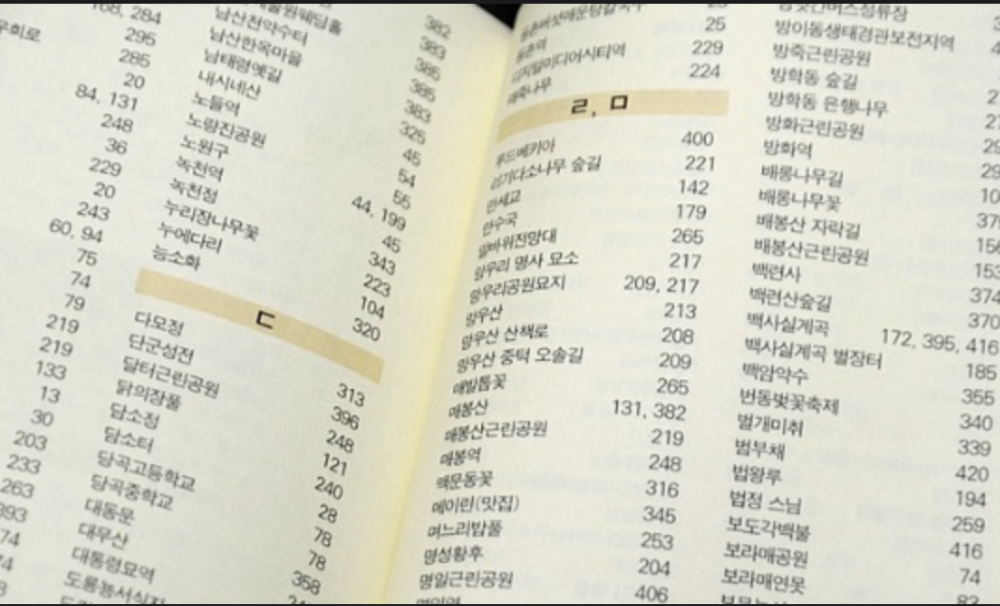
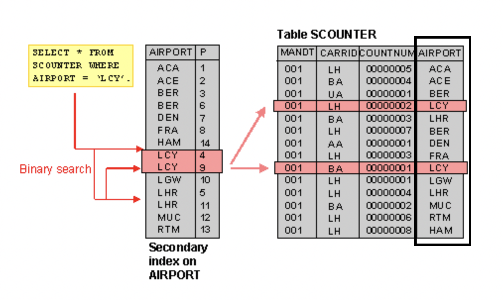

# Database

***

## Table of Contents

- [인덱스란 무엇인가?](####인덱스index란-무엇인가)

***

### [Index]

#### 인덱스(Index)란 무엇인가?

##### 1. 인덱스의 정의

- 데이터베이스에서 필요한 데이터를 빠르게 검색하기 위해 사용되는 데이터 구조. 인덱스를 활용하면 데이터베이스 안의 모든 행(Row)를 검색할 필요 없이 필요한 데이터를 빠르게 찾는 것이 가능

##### 2. 인덱스의 대표적 예시: 책 끝부분에 있는 색인

- 인덱스 사용의 대표적 예시: **책 끝부분에 있는 색인**
- 책에서 찾고 싶은 단어가 몇 페이지에 있는지 알고 싶다면? 책 뒤에 있는 색인 통해서 단어의 위치를 빠르게 찾을 수 있다.
- 찾고 싶은 단어가 여러 페이지에 있다면? 색인을 통해 단어들이 위치한 페이지 영역을 미리 알 수 있음.
- 예시) 아래 첨부 이미지에서 백사실 계곡이라는 단어는 172, 395, 416 페이지에 있음, 또한 173-416 페이지 영역에 모든 단어가 있음.
- 책에 색인이 없다면? 필요한 단어를 찾기 위해 책 전체를 처음부터 끝가지 검색해야함.
- 책의 색인과 마찬가지로, **데이터베이스에서 인덱스는 데이터의 위치를 미리 정리해두어 필요한 조건으로 검색을 빠르게 수행하도록 지원.**

##### 3. 데이터베이스에서 인덱스 생성 방식

- 데이터베이스 테이블(SCOUNTER)의 특정 열(AIRPORT)에 대해서 인덱스를 설정할 경우. 서버는 해당 열(AIRPORT)에 들어있는 데이터들의 값과 그 위치를 정렬하여 저장(인덱스 생성). 해당 열을 조건으로 데이터 검색을 수행하면 해당 조건의 단어를 충족하는 데이터 위치를 해당 테이블을 모두 검색(Full-Scan)하지 않아도 찾은 수 있음.
- 예시) 아래 테이블(SCOUNTER) 내 AIRPORT열을 기준으로 인덱스를 생성하고 그 중 LCY라는 값을 찾는 Case
  - 서버는 인덱스를 보고 L로 시작하는 단어가 있는 영역을 검색 영역으로 설정
  - 다음에는 C, 다음에는 Y 순으로 검색 영역을 축소, 최종적으로 LCY가 포함된 단어가 위치한 영역은 4, 9 두 곳인 것을 특정하고 실제 테이플에서 데이터를 검색해서 클라이언트한테 전달

##### 4. 인덱스를 사용하는 이유는?

- 핵심: 인덱스의 데이터는 **정렬**되어있다. 그렇기 때문에 

- 장점
  - 테이블 조회 속도를 향상시키고 시스템 부하를 낮추어준다.(책 색인이 있다면 필요한 단어 검색에 모든 책을 뒤지지 않아도 된다.)

- 단점
  - 테이블에 수정 사항이 계속 발생할 경우 오히려 검색 성능이 떨어질 수 있다.(책 내용에 추가된 내용이 있다면 색인을 모두 수정해야 한다.)
  - 인덱스 생성을 위해 추가적인 저장 공간이 필요(책 색인을 만들기 위한 추가적인 페이지가 필요하다.)
  - 인덱스 생성 대상 열에 중복된 값이 많을 경우에는 검색 성능이 인덱스를 만들기 전과 큰 차이가 나지 않는다.

##### 5. 결론: 어떠한 경우에 인덱스를 사용하는 것이 좋은가?
- 데이터 수가 많고, 데이터가 중복되지 않고, 데이터의 수정이 자주 발생하지 않는 데이터에 적합.

[[뒤로](##Table-of-Contents)]
