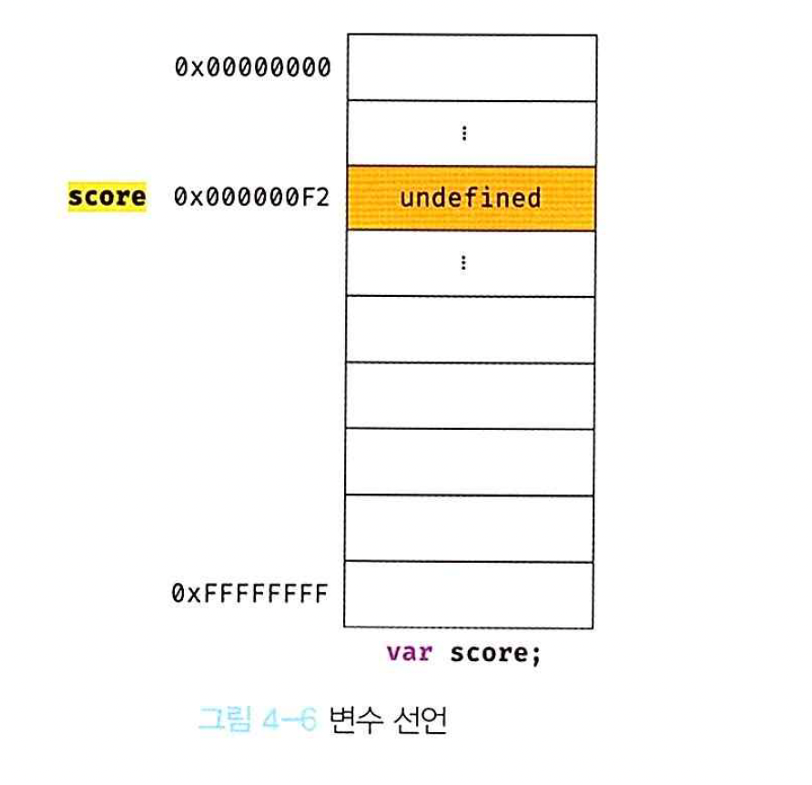
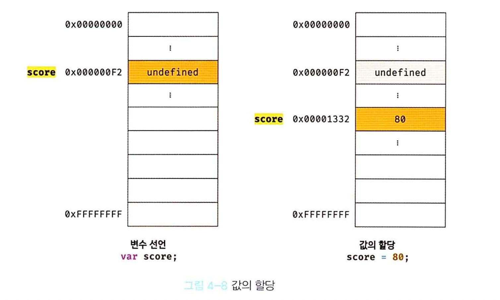
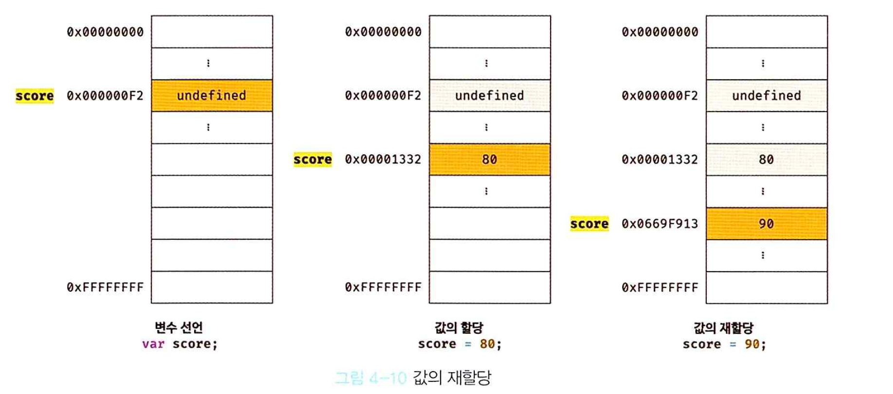

# 4장. 변수

## 4.1. 변수란 무엇인가? 왜 필요한가?

- 변수(variable): 하나의 값을 저장하기 위해 확보한 메모리 공간을 식별하기 위해 붙인 이름. 개발자는 변수가 가리키는 메모리 주소를 통해서 안전하게 값에 접근할 수 있음.(메모리에 직접 접근한다면 현재 사용 중인 메모리 데이터를 건드려 치명적 오류를 발생할 수 있음)
- 변수의 할당(assignment): 변수에 값을 저장하는 것.
- 변수의 참조(reference): 변수에 저장된 값을 읽어들이는 것.

## 4.2. 식별자
- 식별자(identifier): 메모리 상에 존재하는 어떠한 값을 구별하여 식별할 수 있는 이름, 저장된 메모리 주소를 통해 값을 식별.
  - 변수를 비롯하여 함수와 클래스 등 모든 것들의 이름은 모두 식별자임.
  - 식별자는 실행 컨텍스트(엔진이 소스 코드를 평가 및 실행을 관리하는 영역)에 등록된다.


## 4.3. 변수 선언
- 변수 선언(variable declaration): 변수 이름을 등록하고 이를 자바스크립트 엔진에 알리는 단계.
- 초기화: 값을 저장하기 위한 메모리 공간을 확보하고, 암묵적으로 undefined를 할당하는 단계. 초기화를 하지 않으면 이전에 사용했던 값이 메모리에 남아 오류를 발생할 수 있음.
- 키워드(keyword): 코드를 해석하고 실행하는 프로그램(자바스크립트) 엔진이 수행할 동작을 규정한 명령어.


## 4.4. 변수 선언의 실행 시점과 변수 호이스팅
- 변수 호이스팅: 변수의 선언 및 초기화 단계가 런타임 단계(소스 코드가 순차적으로 실행되는 단계) 이전에 먼저 동작하는 프로세스.
- 자바스크립트는 런타임 단계 이전 모든 식별자을 찾아 먼저 실행.

## 4.5. 값의 할당
- 할당(assignment): 변수에 값을 저장하는 것. 할당 연산자(=)을 사용.
- 변수 선언(런타임 이전)과 값의 할당(런타임 이후)을 하나의 문(statement)로 단축하여 표현 가능.(한줄로 표현해도 단계는 각각 진행)
```javascript
var score;  // 변수 선언, 런타임 이전에 먼저 실행
score = 80; // 값의 할당, 런타임 과정에서 실행
var score = 80; // 변수 선언과 값의 할당
```

- 값을 할당할 때는 선언 당시의 메모리 주소가 아닌 새로운 메모리 공간에 할당된 값이 저장.


## 4.6. 값의 재할당
- 재할당: 변수에 저장된 값을 다른 값으로 다른 값으로 변경하고, 그 값을 새롭게 확보된 다른 메모리 공간에 저장하는 것.


## 4.7. 식별자 네이밍 규칙
- 예약어는 식별자로 사용할 수 없음.
- 식별자는 특수문자를 제외한문자, 언더스코어（-), 달러기호（$)로 시작해야 힌다. 숫자로 시작하는 것은 허용하지 않는다.
- 식별자는 특수문자를 제외한 문자, 숫자, 언더스코어（-), 달러 기호（$)를 포함할 수 있다.