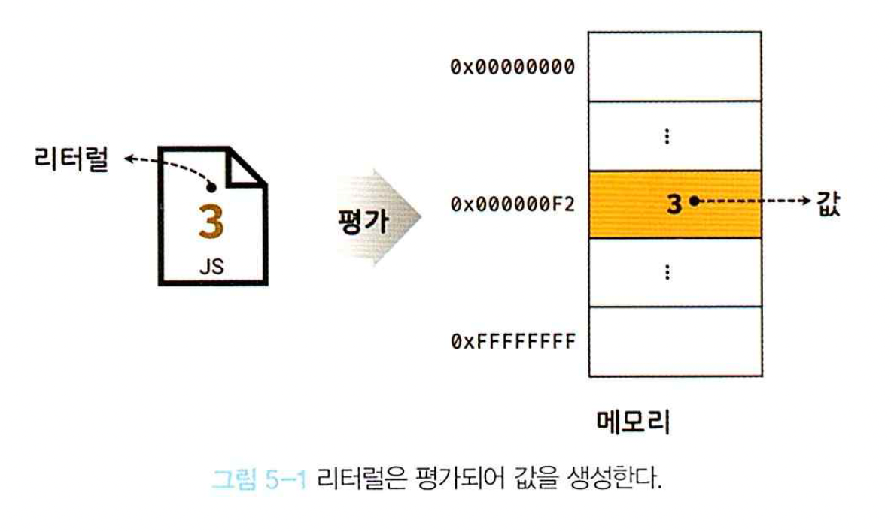
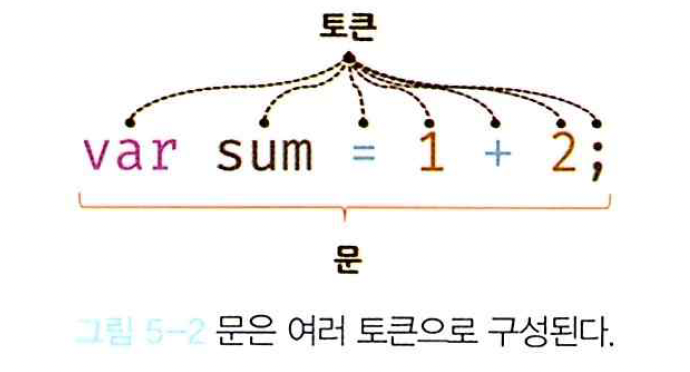

# 05장. 표현식과 문

## 5.1. 값
- 값(value): 표현식(expression)이 평가(evaluate)되어 생성된 결과.
  - 표현식: 값을 반환하는 식 또는 코드.
  - 평가: 식을 해석해서 값을 생성 또는 참조하는 것.


## 5.2. 리터럴
- 리터럴(literal): 사람이 이해할 수 있는 또는 약속된 문자 또는 기호를 통해 값을 생성하는 표기법.



## 5.3. 표현식
- 표현식(expression): 값으로 평가될 수 있는 문(statement)(이것이 중요). 표현식이 평가(evaluate)되면서 새로운 값을 형성하거나 기존 값을 참조.

## 5.4. 문
- 문(statement): 프로그램을 구성하는 최소한의 실행 단위이며 여러 토큰으로 구성. 문의 집합이 프로그램이며, 이는 컴퓨터에 내리는 최소 단위의 명령. 선언문, 할당문, 조건문, 반목문으로 구분.
- 토큰(token): 문법적으로 나눌 수 없는 최소한의 기본 요소.


## 5.6. 표현식인 문과 표현식이 아닌 문
- 표현식 여부를 판단하는 방법: 변수에 할당해보자(표현식의 정의가 값으로 평가될 수 있는 문이기 때문)

```javascript
// 변수 선언문은 값으로 평가될 수 없으므로 표현식이 아니다.
var x;
// 1, 2, 1 + 2, x = 1 + 2는 모두 표현식이다.
// x = 1 + 2는 표현식이면서 완전한 문이기도 하다.
x = 1 + 2;
```