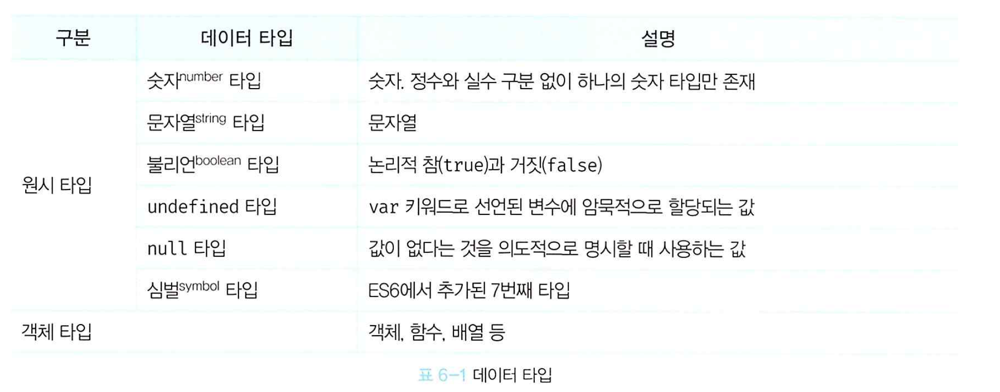

# 06장. 데이터 타입

- 데이터 타입(data type): 값의 종류. 자바스크립트의 모든 값은 데이터 타입을 가짐.
- 데이터 타입은 총 7개이며, 원시 타입(primitive type)과 객체 타입(object/reference)으로 분류.
- 데이터 타입 정의ㄹ르 통해 개발자가 어떠한 의도를 가지고 값을 생성했는지를 파악 가능.

## 6.1. 숫자 타입
- 자바스크립트의 경우에는 숫자 타입이 하나만 존재.
 
## 6.2. 문자열 타입
- 문자열을 따옴표로 감싸는 이유? 식별자 또는 키워드와 같은 토큰과 구분하기 위해.

## 6.3. 템플릿 리터럴
- 멀티 라인 문자열, 표현식 삽입 등 각종 편리한 문자열 처리 기능 제공. 런타임 과정에서 일반 문자열로 변환되어 처리. 일반 문자열의 경우에는 줄바꿈을 실행하기 위해서는 이스케이프 시퀸스를 사용해야 함.
- 백틱(``)으로 구분하여 사용.

### 6.3.2. 표현식 삽입
- 문자열은 문자열 연산자 +를 통해서 서로 연결할 수 있음. 
- 표현식 삽입의 경우에는 무조건 템플릿 리터럴을 사용해서 삽입해야 문자열로 취급됨.

## 6.4. 불리언 타입
- 참(true)와 거짓(false) 값만을 나타내는 데이터 타입.

## 6.5. undefined 타입
- 변수의 선언 이후 값이 할당되지 않은 변수를 초기화할 때 자바스크립트 엔진이 초기화하는 데이터 타입.

## 6.6. null 타입
- 개발자가 변수에 값이 없다는 것을 의도적으로 명시할 때 사용하는 데이터 타입. 변수가 이전에 참조하던 값을 더 이상 참조하지 않겠다는 의미. null 타입 사용을 통해 참조하지 않는 메모리 공간을 빠르게 확보 할 수 있음.

## 6.7. 심벌 타입
- 다른 값과 중복되지 않는 유일무이한 값. 이름 충돌 위험이 없는 키를 만들기 위해 주로 사용.

## 6.8. 객체 타입

## 6.9. 데이터 타입의 필요성
- 데이터 타입 설정을 통해 필요한 메모리 공간을 낭비 없이 관리할 수 있다.(값의 저장 및 참조시의 메모리 공간을 결정)
- 데이터 타입에 따른 값의 해석을 결정 할 수 있음.(모든 결과는 2진수, 이것을 어떻게 해석할 것이냐를 결정)

## 6.10. 동적 타이핑
- 자바스크립트의 모든 값은 데이터 타입을 가짐. 
- 정적 타입 언어의 경우에는 명시적 선언(변수 선언 시 변수에 할당할 데이터 타입을 사전에 선언)이 필요. 컴파일 시점에서 데이터 타입 체크를 통해 오류를 사전에 체크함. 
- 자바스크립트는 동적 타입의 언어. 변수의 선언(메모리 공간의 확보)이 아닌 할당(변수에 값을 저장)하는 단계에서 데이터 타입이 결정.(동적 타이핑)
- 동적 타입의 언어에서의 주의점
  - 변수는 필요한 경우에 따라 제한적으로 사용. 재할당 과정에서 변수 타입을 잘 못 예측해 오류가 발생할 수 있음.
  - 변수의 유효 범위는 최대한 좁게 설정. 넓을 수록 오류의 가능성이 높음.
  - 전역 변수 사용은 최소화.
  - 변수보다는 상수를 사용해 값의 변경을 억제.
  - 변수 이름은 목적과 의미에 맞게 사용.

