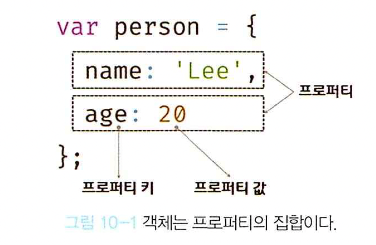
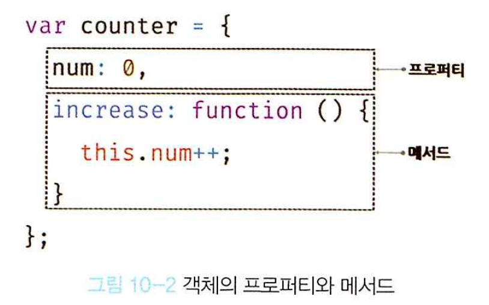

# 10장. 객체 리터럴

## 10.1. 객체란?
- 다양한 타입의 값들을 하나의 단위로 구성한 복합적인 자료 구조.
- 원시 타입의 값과는 달리 객체 타입의 값은 변경이 가능함. 
- 객체는 프로퍼티의 구성 집합, 프로퍼티는 키(key)와 값(value)로 구성.
  - 프로퍼티(property): 객체의 상태를 나타내는 값(data).
  - 메서드(method): 프로퍼티를 참조하고 조작할 수 있는 동작(behavior).
- 함수 또한 프로퍼티의 값이 될 수 있음, 이 경우 메서드(method)라고 명칭.
- 객체를 통해 객체 내 상태 값(프로퍼티)와 동작(메서드)를 모두 포함할 수 있음.



## 10.2. 객체 리터럴에 의한 객체 생성
- 인스턴스: 클래스에 의해 생성되어 메모리에 저장된 실체. 클래스는 인스턴스를 생성하기 위한 틀의 역할을 수행.
- 객체 리터럴(약속된 문자 또는 기호를 사용해 값을 생성하는 표기법)
- 자바스크립트의 경우 객체 생성 과정에서 new와 같은 생성자를 호출할 필요가 없음
- 객체 리터럴을 제외한 객체 생성은 함수를 통해 생성.
  
```javascript
// 객체명 생성
let person = {
// 객체 프로퍼티 및 메서드 생성(중괄호 안에 프로퍼티를 정의)
  name: 'Lee',
  sayHello: function () {
    console.log(`Hello! My name is ${this.name}.`);
  }
};  //마무리는 세미콜론

console.log(typeof person); // object
console.log(person); // {name: "Lee", sayHello: ƒ}
```

## 10.3. 프로퍼티
- **객체는 프로퍼티의 집합이며, 프로퍼티는 키와 값으로 구성된다.**
- 프로퍼티 키: 프로퍼티 값에 접근하기 위한 이름. 식별자 역할. 모든 문자열 및 심벌 사용 가능.
- 프로퍼티 값: 키를 통해 접근 가능한 값. 자바스크립트에서 사용할 수 있는 모든 값(함수 등)을 사용 가능.
```javascript
// 일반적인 객체 생성 방식
var person = {
  // 프로퍼티 키는 name, 프로퍼티 값은 'Lee'
  name: 'Lee',
  // 프로퍼티 키는 age, 프로퍼티 값은 20
  age: 20
};
```

```javascript
//표현식을 활용한 객체 생성 방식
var obj = {};
var key = 'hello';

// ES5: 프로퍼티 키 동적 생성
obj[key] = 'world';
// ES6: 계산된 프로퍼티 이름
// var obj = { [key]: 'world' };

console.log(obj); // {hello: "world"}
```

## 10.4. 메서드
- 프로퍼티 값이 함수일 경우 이를 구분하기 위해 메서드(method)로 지칭. 객체에 묶여 있는 함수.

## 10.5. 프로퍼티 접근
- 프로퍼티 접근 방식
  - .을 활용한 마침표 표기법
  - []를 활용한 대괄호 표기법